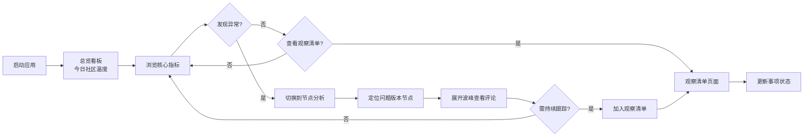

## 1. 产品概述
面向游戏工作室老板与项目制作人的桌面端口碑观察工具，用少量核心指标快速判断一款游戏近期社区口碑是否健康，支持每周例会、立项复盘和发行策略调整场景。

- 核心目标：将分散的社区数据浓缩为可决策的口碑信号，减少团队对"感觉"的依赖
- 目标用户：游戏工作室老板、项目制作人、运营负责人
- 使用场景：每周运营例会、版本上线复盘、竞品监控、风险预警

## 2. 核心功能

### 2.1 用户角色
| 角色 | 登录方式 | 核心权限 |
|------|----------|----------|
| 制作人/管理者 | 本地启动即可使用 | 查看全部看板、管理观察清单、导出数据 |

### 2.2 功能模块
1. **总览看板**：今日社区温度、活跃讨论趋势、正负评价比例、核心争议点、竞品对比
2. **节点分析**：版本节点时间线、讨论热度波峰、事件前后口碑变化、典型评论摘要
3. **观察清单**：风险争议跟踪、责任人分配、下次查看时间、状态管理

### 2.3 页面详情
| 页面名称 | 模块名称 | 功能描述 |
|----------|----------|----------|
| 总览看板 | 今日社区温度 | 综合评分卡片，用颜色直观展示口碑健康度 |
| 总览看板 | 活跃讨论趋势 | 7日讨论量折线图，标注关键事件点 |
| 总览看板 | 正负评价比例 | 环形图展示正面/中性/负面占比，附带环比变化 |
| 总览看板 | 核心争议点 | 按热度排序的争议话题列表，附带情绪标签 |
| 总览看板 | 竞品对比 | 同品类产品的口碑指标横向对比柱状图 |
| 节点分析 | 版本时间轴 | 横向时间线展示版本节点（新英雄、新皮肤、赛季、付费礼包等） |
| 节点分析 | 热度波峰图 | 讨论量曲线与版本节点叠加，可点击展开 |
| 节点分析 | 评论摘要 | 展开波峰后显示典型正/负面评论，支持关键词高亮 |
| 节点分析 | 情绪趋势 | 事件前后7天的情绪变化曲线 |
| 观察清单 | 风险列表 | 卡片式展示正在观察的争议事项 |
| 观察清单 | 新增条目 | 弹窗表单：争议描述、来源链接、责任人、下次查看时间、优先级 |
| 观察清单 | 状态管理 | 标记为观察中/已解决/需升级 |
| 观察清单 | 提醒机制 | 临近查看日期的条目高亮显示 |

## 3. 核心流程

### 3.1 主流程
用户打开应用 → 默认进入总览看板浏览今日口碑概况 → 如需深入分析切换到节点分析 → 发现需持续跟踪的问题加入观察清单 → 周会时打开观察清单逐项跟进

### 3.2 流程图

## 4. 用户界面设计

### 4.1 设计风格
- **主色调**：深 slate 灰背景（#0f172a），营造专业数据看板氛围
- **强调色**：翡翠绿（正面）、琥珀橙（中性）、玫瑰红（负面），信息编码清晰
- **辅助色**：蓝色系用于交互元素和数据可视化
- **字体**：系统无衬线字体栈，数字使用等宽字体提升可读性
- **布局风格**：卡片式栅格布局，信息密度适中，留白克制
- **视觉风格**：专业克制、数据驱动、减少装饰性元素、强调信息层级

### 4.2 页面设计概览
| 页面名称 | 模块名称 | UI 元素 |
|----------|----------|---------|
| 总览看板 | 顶部导航 | 三选项卡切换、项目名称、日期选择器 |
| 总览看板 | 温度指标卡 | 大数字+状态色圆环+趋势箭头+环比文字 |
| 总览看板 | 趋势图卡片 | 带渐变填充的折线图、悬停显示详情 |
| 总览看板 | 争议点列表 | 带情绪标签的条目、热度条、点击跳转 |
| 总览看板 | 竞品对比 | 分组柱状图、可切换指标维度 |
| 节点分析 | 时间轴导航 | 横向滚动节点列表、图标区分事件类型 |
| 节点分析 | 主图表区 | 大面积折线+柱状组合图、可框选缩放 |
| 节点分析 | 评论抽屉 | 右侧滑出、评论分组、关键词高亮 |
| 观察清单 | 筛选栏 | 状态筛选、排序、搜索框 |
| 观察清单 | 卡片网格 | 彩色状态条、责任人头像、倒计时提醒 |
| 观察清单 | 新增弹窗 | 表单式布局、日期选择器、优先级选择 |

### 4.3 响应式
- 桌面端优先设计（1440px 基准）
- 支持 1280px ~ 1920px 宽屏自适应
- 三栏布局在窄屏下自动调整为两栏
- 最小支持宽度 1024px

### 4.4 动效与交互
- 页面切换：淡入淡出过渡
- 数据加载：骨架屏占位
- 悬停反馈：卡片微上浮、数据点高亮
- 图表交互：平滑过渡动画
- 抽屉/弹窗：滑入动效
