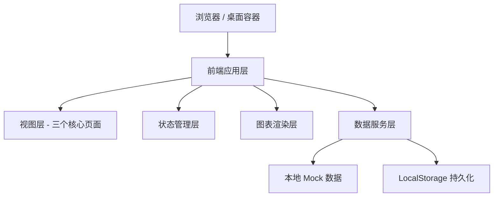

## 1. 架构设计



## 2. 技术选型说明

- **前端框架**：纯原生 HTML + CSS + JavaScript（轻量、无构建依赖、启动快、适合桌面端单文件分发）
- **图表库**：Chart.js@4.x（轻量级、支持多种图表类型、Canvas 渲染性能好）
- **图标**：纯 CSS 图标 + Unicode 符号（避免外部依赖）
- **数据持久化**：LocalStorage（观察清单数据本地存储）
- **数据来源**：内置 Mock 数据（演示用，可扩展为 API 接入）

选择纯原生技术栈的理由：
1. 这是一个桌面端工具，追求"双击即用"，无需安装依赖
2. 功能以数据展示为主，交互复杂度适中，原生 JS 足够
3. 单文件或少量文件便于分发和版本管理
4. 启动速度快，符合工具类产品的使用预期

## 3. 文件结构

| 文件/目录 | 用途 |
|-----------|------|
| `index.html` | 主入口，包含三视图容器结构 |
| `css/style.css` | 全局样式、主题变量、组件样式 |
| `js/data.js` | Mock 数据定义（游戏数据、评论、节点等） |
| `js/charts.js` | 图表渲染封装（折线图、环形图、柱状图等） |
| `js/dashboard.js` | 总览看板视图逻辑 |
| `js/nodes.js` | 节点分析视图逻辑 |
| `js/watchlist.js` | 观察清单视图逻辑 |
| `js/app.js` | 主应用逻辑（路由、状态、初始化） |

## 4. 核心数据模型

### 4.1 社区温度数据
```javascript
{
  date: "2026-06-19",
  score: 72,           // 综合口碑分 0-100
  trend: 3.2,          // 环比变化百分比
  discussionCount: 12847,
  positiveRatio: 0.58,
  neutralRatio: 0.27,
  negativeRatio: 0.15
}
```

### 4.2 争议点数据
```javascript
{
  id: "controversy-001",
  title: "新英雄平衡争议",
  sentiment: "negative", // positive / neutral / negative
  heat: 2340,
  relatedNode: "hero-release",
  summary: "玩家认为新英雄爆发过高，上路生态失衡"
}
```

### 4.3 版本节点数据
```javascript
{
  id: "node-001",
  type: "hero",         // hero / skin / season / bundle / patch
  date: "2026-06-15",
  title: "新英雄「影刃」上线",
  description: "刺客型英雄，附带伴生皮肤",
  beforeSentiment: 0.65,
  afterSentiment: 0.48,
  peakDiscussion: 8520
}
```

### 4.4 观察清单项
```javascript
{
  id: "watch-001",
  title: "匹配机制吐槽",
  description: "近期关于匹配公平性的负面讨论上升",
  sourceUrl: "",
  priority: "high",     // high / medium / low
  status: "watching",   // watching / resolved / escalated
  assignee: "张策划",
  nextReviewDate: "2026-06-21",
  createdAt: "2026-06-18",
  notes: "待观察三天后趋势"
}
```

### 4.5 竞品数据
```javascript
{
  name: "竞品A",
  score: 68,
  discussionCount: 9800,
  positiveRatio: 0.52
}
```

## 5. 状态管理

采用简单的发布订阅模式：
- 全局状态对象存储当前视图、选中日期、观察清单数据
- 各视图模块订阅状态变化
- 用户操作通过 action 函数更新状态并触发视图刷新

## 6. 性能与体验优化

1. **图表懒渲染**：切换到对应视图时才渲染图表
2. **数据缓存**：Mock 数据一次性加载，图表数据按需计算
3. **CSS 动画**：优先使用 transform 和 opacity 属性实现动效
4. **防抖处理**：窗口 resize 和搜索输入添加防抖
5. **LocalStorage 持久化**：观察清单数据自动保存
